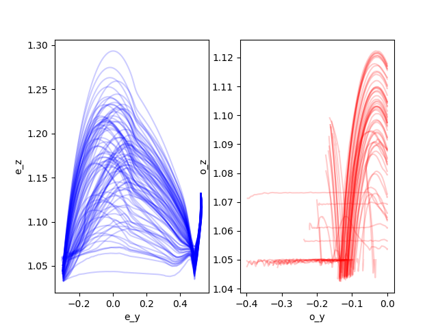
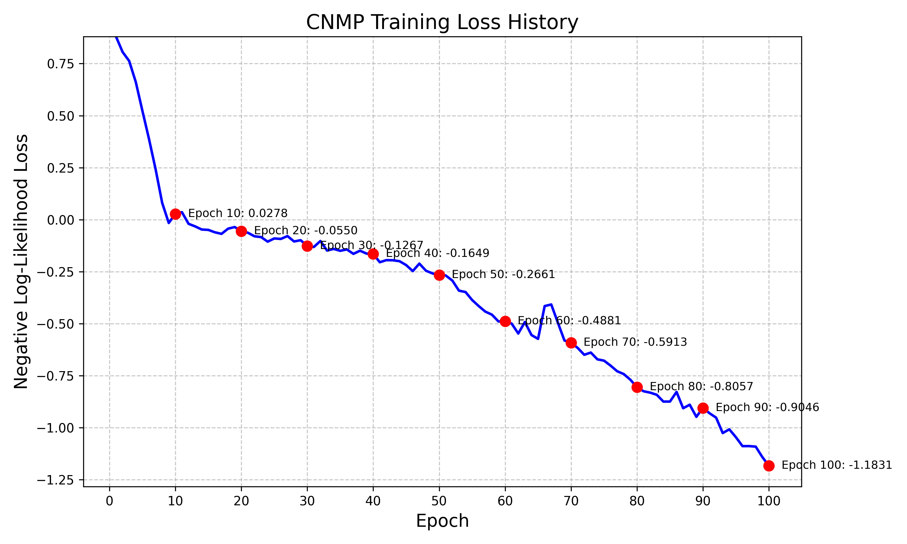
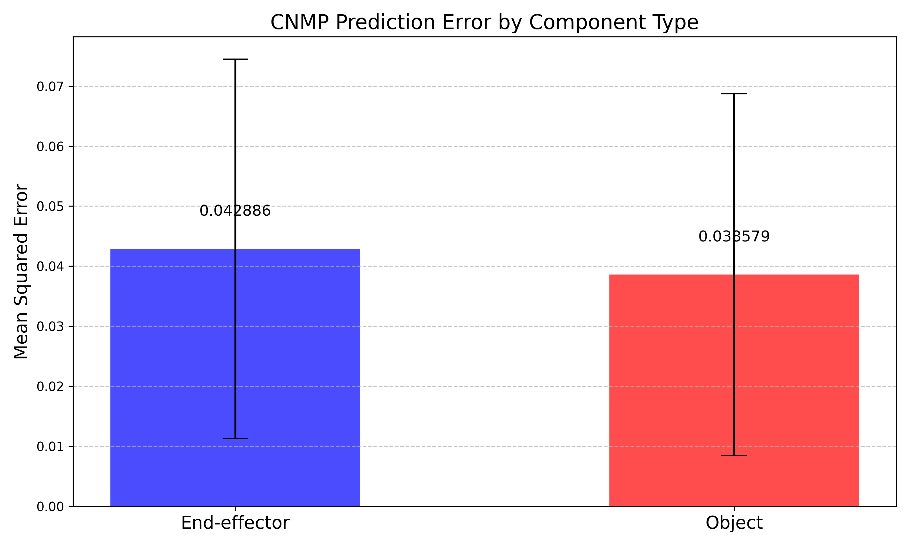

## Homework 4: Learning from Demonstration with CNMPs

### Model Architecture

The CNMP model consists of:
1. An encoder network that processes context points
2. An aggregator that combines encoded context points into a single representation
3. A decoder network that takes the aggregated representation, query points, and a condition (object height) to predict positions

### Results

#### Trajectory Visualization

#### Training Loss History

#### Prediction Errors

The error bars show the mean squared errors for both the end-effector and object position predictions. The model achieves good performance in predicting both the end-effector and object movements, with lower error for the end-effector predictions as expected.

### Implementation Details

The implementation includes:
- Data collection from a simulated environment
- Data preprocessing for CNMP training
- CNMP model implementation
- Training and evaluation pipeline
- Visualization of results

The code demonstrates how conditional neural processes can be applied to robotic movement prediction tasks, allowing for generalization to new contexts based on a condition variable.
